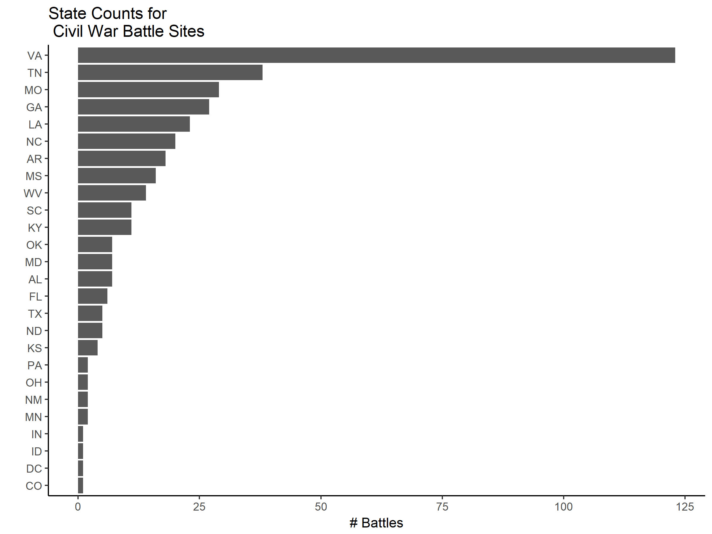
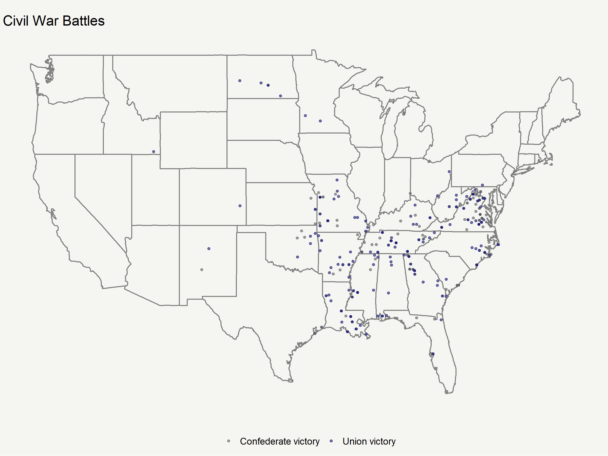

**ISSUE** -- Memory allocation for raster relief of contiguous U.S. -- Use only eastern U.S.?

``` r
knitr::opts_chunk$set(
    out.width = "100%",
    dpi = 300,
    fig.width = 8,
    fig.height = 6,
    fig.path = "plots/",
    strip.white = T,
    dev = "png",
    dev.args = list(png = list(bg = "transparent"))
)
```

``` r
# Cleaned data from import_cleaning.R
load("results/civil_war.Rda")
```

``` r
library(ggmap)
```

    ## Loading required package: ggplot2

``` r
library(dplyr)
```

    ## 
    ## Attaching package: 'dplyr'

    ## The following objects are masked from 'package:stats':
    ## 
    ##     filter, lag

    ## The following objects are masked from 'package:base':
    ## 
    ##     intersect, setdiff, setequal, union

``` r
library(raster)
```

    ## Loading required package: sp

    ## 
    ## Attaching package: 'raster'

    ## The following object is masked from 'package:dplyr':
    ## 
    ##     select

Spatial Data
------------

``` r
relief <- raster("data/US_MSR_10M/US_MSR.tif")
relief_spdf <- as(relief, "SpatialPixelsDataFrame")
```

Battles by State
----------------

``` r
civil_war %>% 
  ggplot(aes(x = state)) +
    geom_bar() +
    theme_classic() + 
    coord_flip() + # Swap x and y axes, so that state abbreviations are readable
    labs(x = "", y = "# Battles",
         title = "State Counts for\n Civil War Battle Sites")
```



Mapping
-------

``` r
p <- civil_war %>% 
  filter(results != "Inconclusive") %>%  
  ggplot(aes(x = lon, y = lat, frame = start_date)) + 
  borders("state") + 
  geom_point(aes(color = results), position = "jitter", alpha = 0.6) + 
  scale_color_manual(values = c("gray39", "midnightblue")) +
  theme_void() +
  theme(plot.background = element_rect(fill = "#f5f5f2", color = NA),
        legend.position = "bottom",
        legend.title = element_blank()) +
  labs(title = "\nCivil War Battles")

p
```



``` r
ggmap::qmplot(lon, lat, data = civil_war, col = "salmon")
USAMap <- ggmap(get_googlemap(center = "Liberal, KS", scale=2, zoom=4, maptype = "satellite"), extent="normal")
USAMap + geom_point(aes(x = lon, y = lat), data = battle_latlong, col = "blue", alpha = 0.6)

get_openstreetmap(bbox = c(left = -127.046, bottom = 19.601, right = -58.052, top =51.836))
```

Hillshade
---------

``` r
alt <- getData('alt', country = "USA")
slope <- terrain(alt[[1]], opt='slope') # only first layer of USA (country level)
aspect <- terrain(alt[[1]], opt='aspect')
### create a relief layer
hill <- hillShade(slope, aspect, angle = 40, direction = 270)
hill_spdf <- as(hill, "SpatialPixelsDataFrame")
plot(hill, col=grey(0:100/100), legend=FALSE)
```
